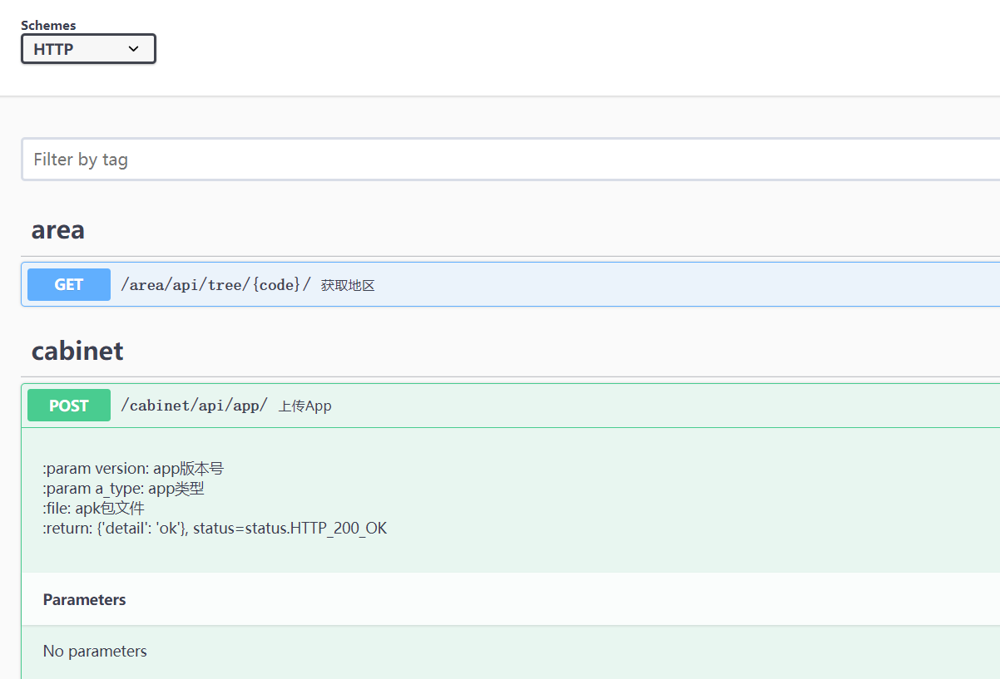
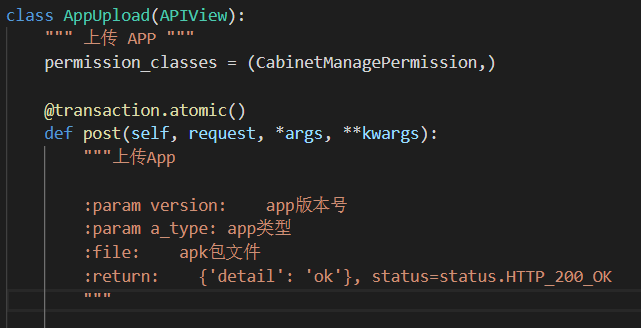

# SzAutoSchema
在drf-yasg基础上，为django restframework项目自动生成openapi文档

# 安装
pip install -U drf-yasg  
pip install git+https://github.com/yang0/SzAutoSchema

# 配置
设置settings.py
-----------------------------------------
    INSTALLED_APPS = [
        ...
        'drf_yasg',
    ]

    SWAGGER_SETTINGS = {
	    'PERSIST_AUTH': False,
	    'REFETCH_SCHEMA_WITH_AUTH': False,
	    'REFETCH_SCHEMA_ON_LOGOUT': False,

	    'DEFAULT_AUTO_SCHEMA_CLASS': 'SzAutoSchema',

	}

设置url.py
-----------------------------------------
	from rest_framework import permissions
	from drf_yasg import openapi
	from drf_yasg.views import get_schema_view

	schema_view = get_schema_view(
	    openapi.Info(
	        title="Snippets API",
	        default_version='v1',
	        description="Test description",
	        terms_of_service="https://www.google.com/policies/terms/",
	        contact=openapi.Contact(email="contact@snippets.local"),
	        license=openapi.License(name="BSD License"),
	    ),
	    public=True,
	    permission_classes=(permissions.AllowAny,),
	)

	urlpatterns = [
		# api 文档
	    re_path(r'^swagger(?P<format>\.json|\.yaml)$',
	        schema_view.without_ui(cache_timeout=0), name='schema-json'),
	    re_path(r'^swagger/$', schema_view.with_ui('swagger',
	                                           cache_timeout=0), name='schema-swagger-ui'),
	    re_path(r'^redoc/$', schema_view.with_ui('redoc',
	                                         cache_timeout=0), name='schema-redoc'),

	    ...
	 ]

# 访问
http://localhost:8080/swagger  效果如下：  

# 其他说明
1 drf_yasg还支持很多高级配置，包括文档浏览的权限控制等，我这里都去掉了  
2 drf_yasg支持mock接口，但是需要侵入业务代码，这里不采用了  
3 接口文件中的注释得这么写：  

