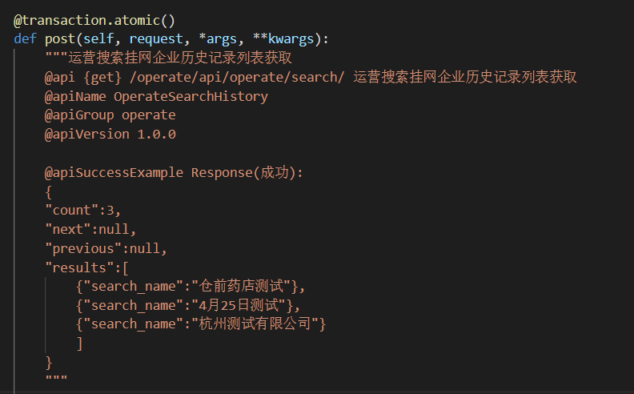

# SzAutoSchema
在drf-yasg基础上，为django restframework项目自动生成openapi文档

# 安装
pip install -U drf-yasg  
pip install -U git+https://github.com/yang0/SzAutoSchema

# 配置
在测试或开发环境中执行命令：
-----------------------------------------
	echo 'export RUN_ENV=dev' 1>> ~/.bashrc && source ~/.bashrc

设置settings.py
-----------------------------------------
	STATIC_ROOT = '/static/'

	INSTALLED_APPS = [
	    ...
	    'django.contrib.staticfiles',
	]

	RUN_ENV = os.getenv("RUN_ENV",default='')
	# swagger相关配置====================
	if RUN_ENV == 'dev':
	    DEV_APPS = [
	        'drf_yasg',
	    ]

	    INSTALLED_APPS += DEV_APPS

	    SWAGGER_SETTINGS = {
	        'PERSIST_AUTH': False,
	        'REFETCH_SCHEMA_WITH_AUTH': False,
	        'REFETCH_SCHEMA_ON_LOGOUT': False,
		'DEFAULT_INFO': 'server.urls.swagger_info', #这里server请更换成自己的路径

	        'DEFAULT_AUTO_SCHEMA_CLASS': 'szautoschema.SzAutoSchema',
	    }
	# swagger相关配置==================

设置url.py
-----------------------------------------
	from rest_framework import permissions
	from drf_yasg import openapi
	from drf_yasg.views import get_schema_view

	swagger_info = openapi.Info(
    title="Snippets API",
    default_version='v1',
    description="""This is a demo project for the [drf-yasg](https://github.com/axnsan12/drf-yasg) Django Rest Framework library.

The `swagger-ui` view can be found [here](/cached/swagger).  
The `ReDoc` view can be found [here](/cached/redoc).  
The swagger YAML document can be found [here](/cached/swagger.yaml).  

You can log in using the pre-existing `admin` user with password `passwordadmin`.""",  # noqa
    terms_of_service="https://www.google.com/policies/terms/",
    contact=openapi.Contact(email="contact@snippets.local"),
    license=openapi.License(name="BSD License"),
)

schema_view = get_schema_view(
    swagger_info,
    public=True,
    permission_classes=(permissions.AllowAny,),
)

	urlpatterns = [
		# api 文档
	    re_path(r'^swagger(?P<format>\.json|\.yaml)$',
	        schema_view.without_ui(cache_timeout=0), name='schema-json'),
	    re_path(r'^swagger/$', schema_view.with_ui('swagger',
	                                           cache_timeout=0), name='schema-swagger-ui'),
	    re_path(r'^redoc/$', schema_view.with_ui('redoc',
	                                         cache_timeout=0), name='schema-redoc'),

	    ...
	 ]

# 访问
http://localhost:8080/swagger  效果如下：  

# 其他说明
1 drf_yasg还支持很多高级配置，包括文档浏览的权限控制等，我这里都去掉了  
2 drf_yasg支持mock接口，但是需要侵入业务代码，这里不采用了  
3 接口文件中的注释按照apiDoc规范，得这么写（后期可以将apiDoc转swagger格式，用来mock接口）：  
  
如果嫌手打注释麻烦，建议在vs code里面装一个apidoc snippets
